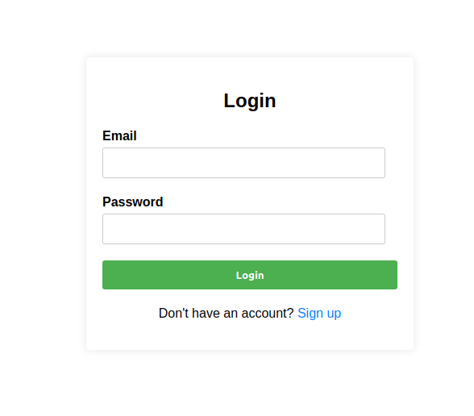
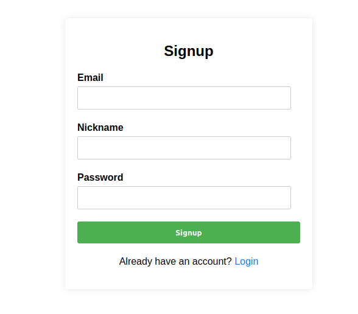
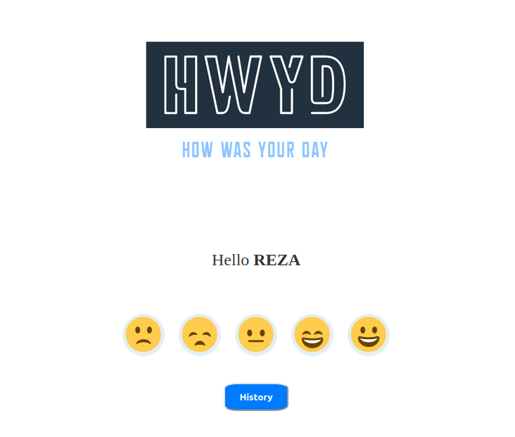
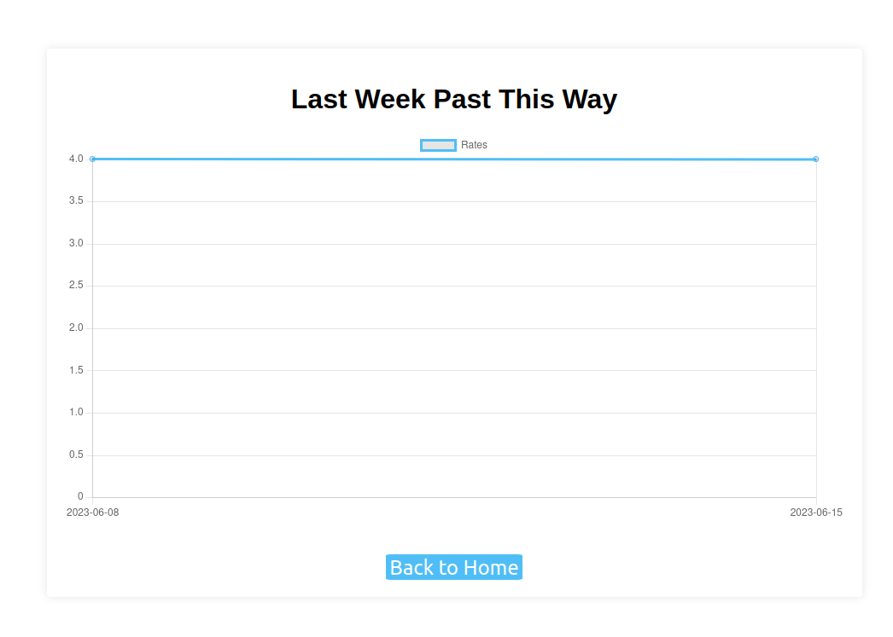

# hwyd

In this project, the main goal is to create a web application using Django, a popular Python web framework. The purpose of the application is to allow users to record their daily feelings or moods. To use the application, users need to create an account or log in if they already have one.

Once logged in, users can access the home page where they will find two options:

1. **Record day feel rate**: This option allows users to record their feelings for the current day. They can rate their mood or describe how they feel using predefined categories or a custom input.

2. **See last week's history**: This option enables users to view their mood history for the past week. It could display a summary of their recorded feelings, such as average mood rating, notable changes, or any trends observed.

